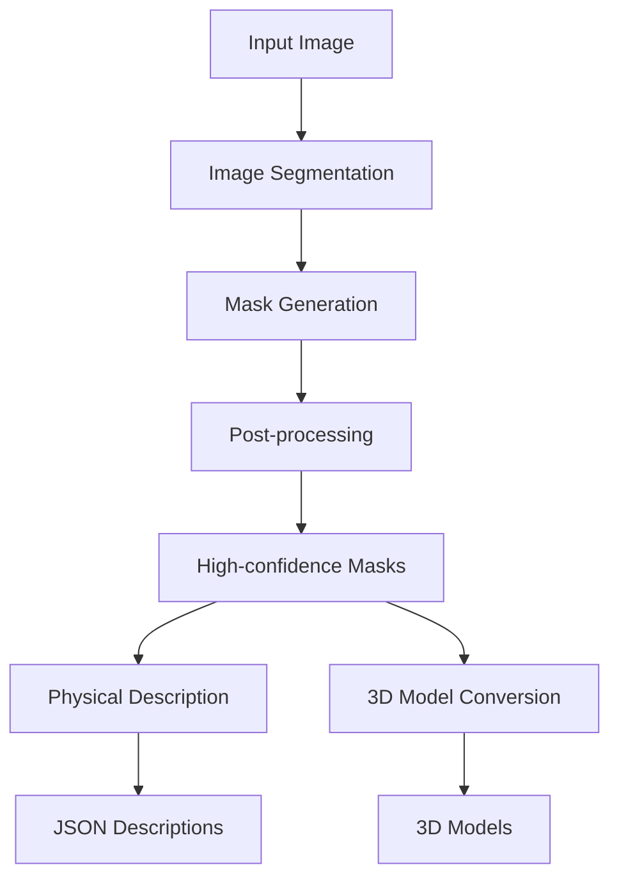

# Segment Annotate

A tool for semantic segmentation, object description, and 3D model conversion. This tool uses SAM2 for segmentation, GPT-4 Vision for object description, and Meshy API for 3D model conversion.

## Project Workflow



## Features

- **Semantic Segmentation**
  - Uses SAM2 (Segment Anything Model 2)
  - Automatic mask generation
  - High-confidence mask filtering
  - Post-processing for better object boundaries

- **Physical Object Description**
  - GPT-4o mini analysis with structured output
  - Material properties detection
  - Geometric measurements
  - Physical characteristics estimation
  - Detailed description of each segment

- **3D Model Conversion**
  - Meshy API integration
  - Automatic topology selection
  - Texture generation
  - PBR material support

## Project Structure

```
segment_annotate/
├── src/                        # Source code
│   ├── segmentation/          # Segmentation module
│   │   ├── segmenter.py      # Core segmentation
│   │   └── description_generator.py  # GPT-4 Vision
│   ├── models/               # Data models
│   │   └── physical_properties.py  # Property schemas
│   ├── conversion/           # 3D conversion
│   │   └── meshy_converter.py  # Meshy API integration
│   └── main.py              # Main entry point
├── results/                  # Generated outputs
│   ├── segmentation/        # Segmentation results
│   │   └── output_TIMESTAMP/
│   │       ├── segments/    # Individual segments
│   │       ├── masks/       # Binary masks
│   │       └── metadata/    # JSON descriptions
│   └── models/              # 3D model outputs
│       └── output_TIMESTAMP/
│           ├── 3d_models/   # Generated OBJ files
│           └── metadata/    # Conversion results
├── requirements.txt         # Dependencies
└── .env                    # API keys
```

## Installation

1. Clone the repository:
```bash
git clone https://github.com/yourusername/segment_annotate.git
cd segment_annotate
```

2. Create a virtual environment and activate it:
```bash
python -m venv venv
source venv/bin/activate  # On Windows: venv\Scripts\activate
```

3. Install dependencies:
```bash
pip install -r requirements.txt
```

4. Set up your API keys in `.env`:
```env
OPENAI_API_KEY=your_openai_api_key
MESHY_API_KEY=your_meshy_api_key
```

## Usage

### Basic Usage

Process a single image with all features:
```bash
python src/main.py --image path/to/your/image.jpg
```

This will:
1. Segment the image into objects
2. Generate physical descriptions
3. Convert segments to 3D models
4. Save all results in timestamped directories

### Advanced Usage

Process existing segmentation results:
```bash
python src/main.py --segmentation-dir results/segmentation/output_TIMESTAMP
```

Specify custom output directory:
```bash
python src/main.py --image input.jpg --output-dir custom/output/path
```

## Output Structure

Each run creates timestamped directories:

### Segmentation Output (`results/segmentation/output_TIMESTAMP/`)
- `segments/`: Individual segment images (PNG with transparency)
- `masks/`: Binary mask files
- `segment_descriptions.json`: GPT-4 Vision descriptions
- `segments_metadata.json`: Segment metadata
- `masks_metadata.json`: Mask metadata
- `segmentation_visualization.png`: Visual overlay of segments

### 3D Models Output (`results/models/output_TIMESTAMP/`)
- `3d_models/`: Generated OBJ files
- `3d_conversion_results.json`: Conversion metadata and results

## Physical Properties

The tool analyzes several physical properties for each segment:

- **Material Properties**
  - Material type (rigid, soft, deformable, etc.)
  - Density (kg/m³)
  - Friction coefficient
  - Surface roughness
  - Elasticity

- **Geometric Properties**
  - Dimensions (width, height, depth in meters)
  - Volume (m³)
  - Symmetry analysis

- **Dynamic Properties**
  - Mass estimation
  - Movement capabilities (rolling, sliding)
  - Stability analysis

- **Interaction Properties**
  - Graspability
  - Stackability
  - Load-bearing capacity
  - Containment volume

## Requirements

- Python 3.8+
- CUDA-capable GPU (recommended)
- OpenAI API key (for GPT-4o mini)
- Meshy API key (for 3D conversion)

## License

MIT License - see LICENSE file for details 