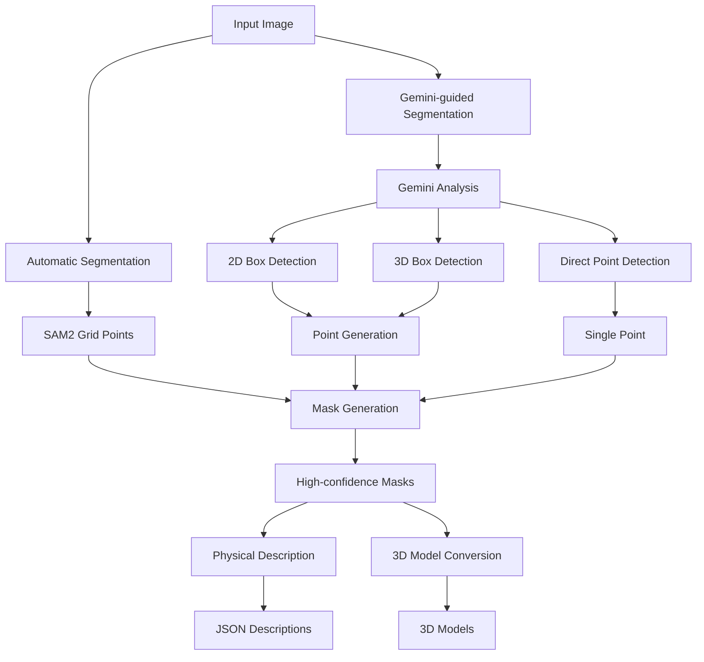

# Segment Annotate

A tool for semantic segmentation, object description, and 3D model conversion. This tool combines SAM2 for segmentation, Gemini for spatial understanding, GPT-4 Vision for object description, and Meshy API for 3D model conversion.

## Project Workflow



## Features

- **Segmentation Pipelines**
  - **Automatic Segmentation**
    - Uses SAM2 (Segment Anything Model 2)
    - Grid-based point selection
    - High-confidence mask filtering
    - Post-processing for better object boundaries
  
  - **Gemini-guided Segmentation**
    - Gemini 2.0 Flash for spatial understanding
    - Multiple detection modes:
      - **2D Box Detection**: Precise rectangular boundaries
      - **3D Box Detection**: Depth-aware object boundaries
      - **Direct Point Detection**: Single-point object identification
    - Intelligent point selection:
      - Box modes: 5 points per object (corners + center)
      - Point mode: Direct object center points
    - Improved accuracy for complex objects

- **Physical Object Description**
  - GPT-4 Vision analysis
  - Material properties
  - Geometric measurements
  - Dynamic characteristics
  - Interaction properties

- **3D Model Conversion**
  - Meshy API integration
  - Textured 3D models
  - Multiple topology options
  - Symmetry detection
  - Automatic UV mapping

## Project Structure

```
segment_annotate/
├── src/                        # Source code
│   ├── segmentation/          # Segmentation module
│   │   ├── segmenter.py      # Core segmentation
│   │   ├── spatial_analyzer.py # Gemini integration
│   │   ├── interactive_segmenter.py # SAM2 interface
│   │   └── description_generator.py  # GPT-4 Vision
│   ├── models/               # Data models
│   │   └── physical_properties.py  # Property schemas
│   ├── conversion/           # 3D conversion
│   │   └── meshy_converter.py  # Meshy API integration
│   └── main.py              # Main entry point
├── results/                  # Generated outputs
│   ├── segmentation/        # Segmentation results
│   │   └── output_TIMESTAMP/
│   │       ├── segments/    # Individual segments
│   │       ├── masks/       # Binary masks
│   │       └── metadata/    # JSON descriptions
│   └── models/              # 3D model outputs
│       └── output_TIMESTAMP/
│           ├── 3d_models/   # Generated OBJ files
│           └── metadata/    # Conversion results
├── debug/                   # Debug visualizations
│   └── gemini_debug_TIMESTAMP/
│       ├── gemini_analysis.png  # Box/point visualization
│       └── gemini_boxes.json    # Raw Gemini data
├── requirements.txt         # Dependencies
└── .env                    # API keys
```

## Installation

1. Clone the repository:
```bash
git clone https://github.com/yourusername/segment_annotate.git
cd segment_annotate
```

2. Create a virtual environment and activate it:
```bash
python -m venv venv
source venv/bin/activate  # On Windows: venv\Scripts\activate
```

3. Install dependencies:
```bash
pip install -r requirements.txt
```

4. Set up your API keys in `.env`:
```env
OPENAI_API_KEY=your_openai_api_key
MESHY_API_KEY=your_meshy_api_key
GOOGLE_API_KEY=your_google_api_key
```

5. Download the SAM2 checkpoint:
```bash
mkdir -p checkpoints
wget -P checkpoints/ https://dl.fbaipublicfiles.com/segment_anything_2/092824/sam2.1_hiera_large.pt
```

## Usage

### Automatic Segmentation

Process an image using the automatic grid-based segmentation:
```bash
python src/main.py --image path/to/image.jpg --pipeline auto --max-objects 20
```

### Gemini-guided Segmentation

Process an image using Gemini's spatial understanding with different modes:

1. 2D Box Detection (Default):
```bash
python src/main.py --image path/to/image.jpg --pipeline gemini --mode 2d --max-objects 10 --point-offset 0.2 --debug
```

2. 3D Box Detection:
```bash
python src/main.py --image path/to/image.jpg --pipeline gemini --mode 3d --max-objects 10 --point-offset 0.2 --debug
```

3. Direct Point Detection:
```bash
python src/main.py --image path/to/image.jpg --pipeline gemini --mode points --max-objects 10 --debug
```

### 3D Model Conversion

By default, the tool only performs segmentation. To also generate 3D models:
```bash
python src/main.py --image path/to/image.jpg --pipeline auto --convert-3d
```

### Advanced Options

- `--output-dir`: Specify custom output directory
- `--checkpoint`: Path to SAM2 checkpoint
- `--model-cfg`: Path to SAM2 model config
- `--point-offset`: Offset ratio for point selection (Box modes only)
- `--temperature`: Temperature for Gemini generation
- `--debug`: Enable debug visualizations
- `--convert-3d`: Enable 3D model conversion (requires Meshy API key)

## Output Structure

Each run creates timestamped directories:

### Segmentation Output (`results/segmentation/output_TIMESTAMP/`)
- `segments/`: Individual segment images (PNG with transparency)
- `masks/`: Binary mask files
- `segment_descriptions.json`: GPT-4 Vision descriptions
- `segments_metadata.json`: Segment metadata
- `masks_metadata.json`: Mask metadata
- `segmentation_visualization.png`: Visual overlay of segments

### Debug Output (`debug/gemini_debug_TIMESTAMP/`)
- `gemini_analysis.png`: Visualization of detected boxes/points
- `gemini_boxes.json`: Raw detection data from Gemini
- `gemini_points.json`: Point detection data (points mode only)

### 3D Models Output (`results/models/output_TIMESTAMP/`)
- `3d_models/`: Generated OBJ files
- `3d_conversion_results.json`: Conversion metadata and results

## Physical Properties

The tool analyzes several physical properties for each segment:

- **Material Properties**
  - Material type (rigid, soft, deformable, etc.)
  - Density (kg/m³)
  - Friction coefficient
  - Surface roughness
  - Elasticity

- **Geometric Properties**
  - Dimensions (width, height, depth in meters)
  - Volume (m³)
  - Symmetry analysis

- **Dynamic Properties**
  - Mass estimation
  - Movement capabilities (rolling, sliding)
  - Stability analysis

- **Interaction Properties**
  - Graspability
  - Stackability
  - Load-bearing capacity
  - Containment volume

## Requirements

- Python 3.8+
- CUDA-capable GPU (recommended)
- OpenAI API key (for GPT-4 Vision)
- Meshy API key (for 3D conversion)
- Google API key (for Gemini)

## License

MIT License - see LICENSE file for details 